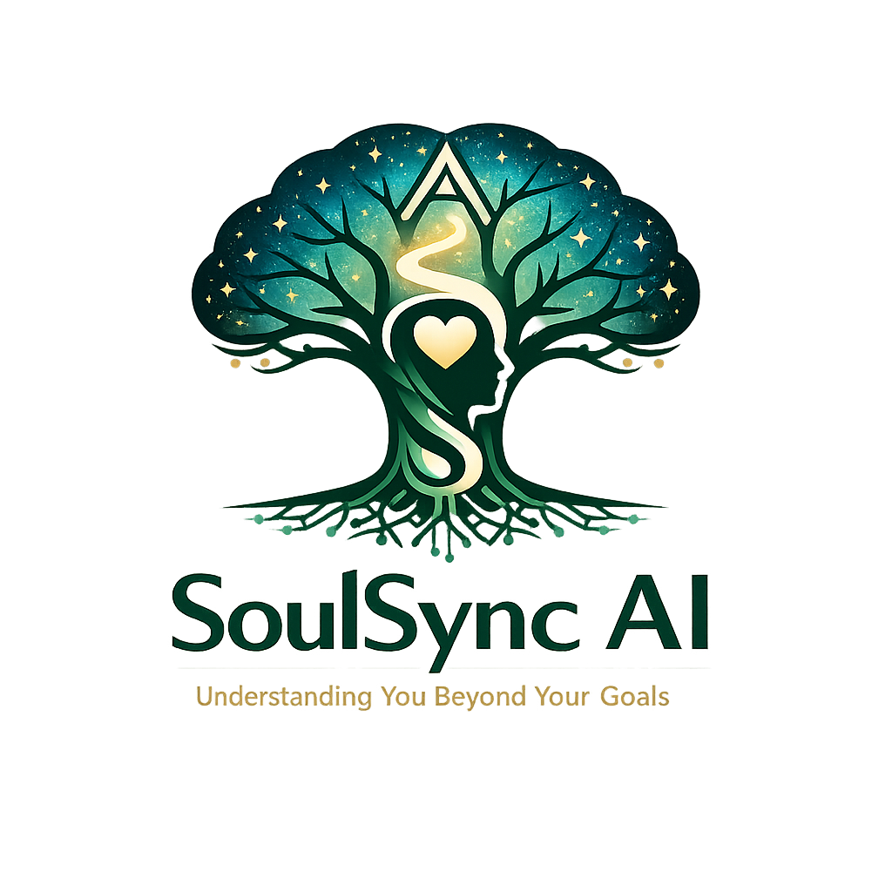
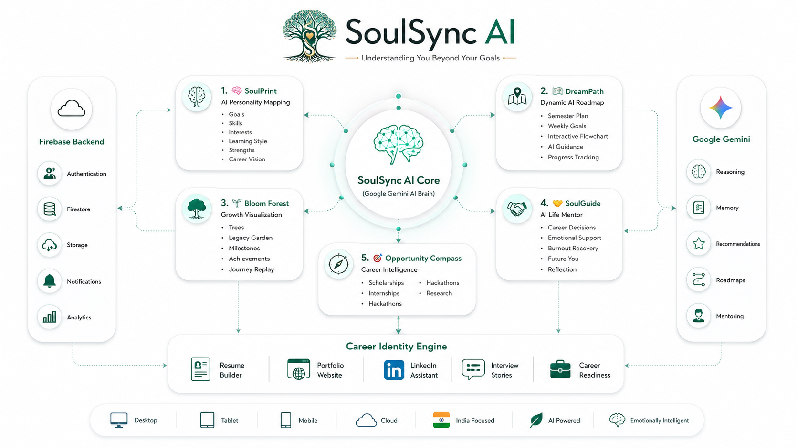
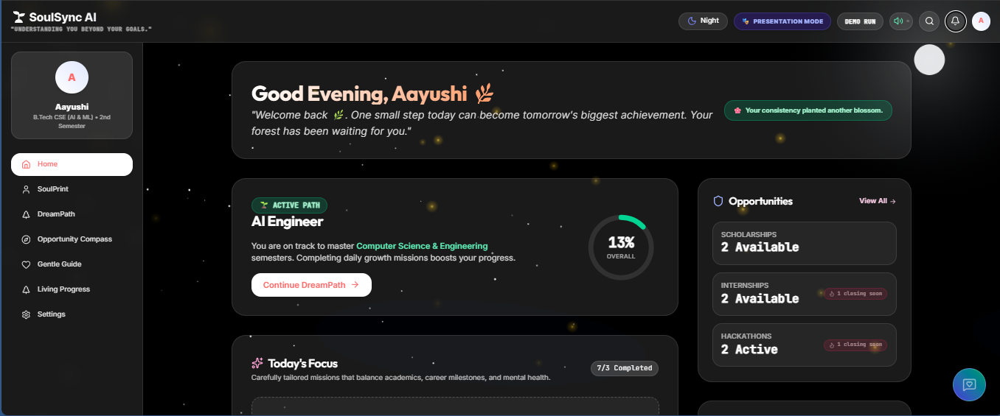
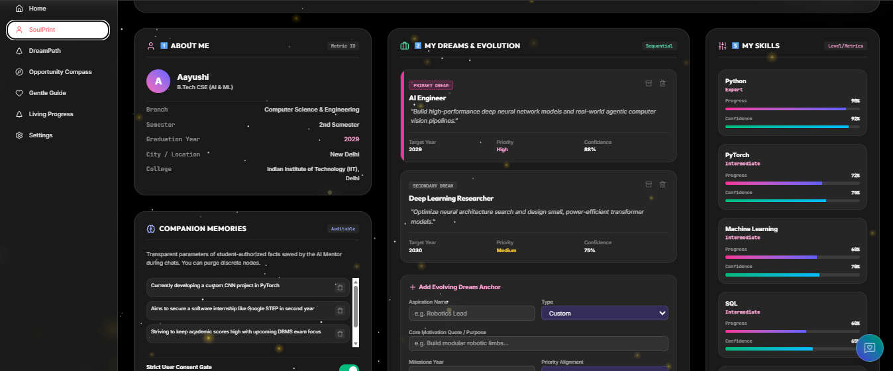
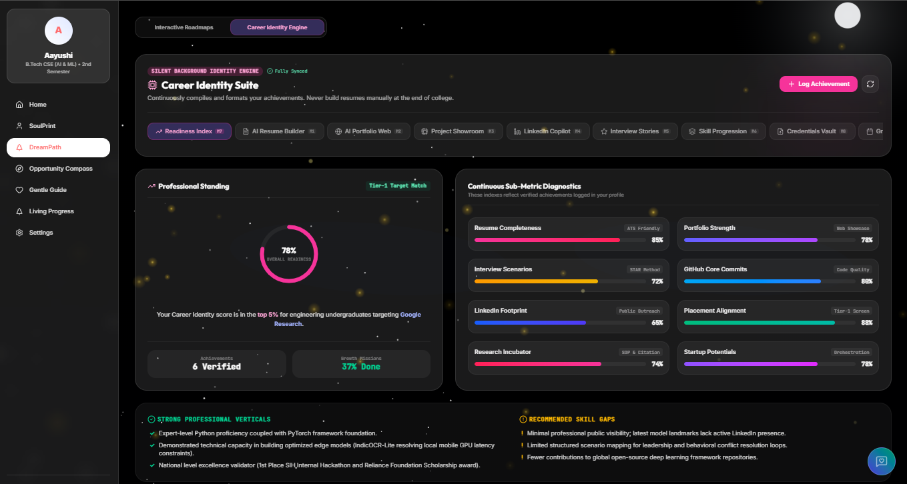
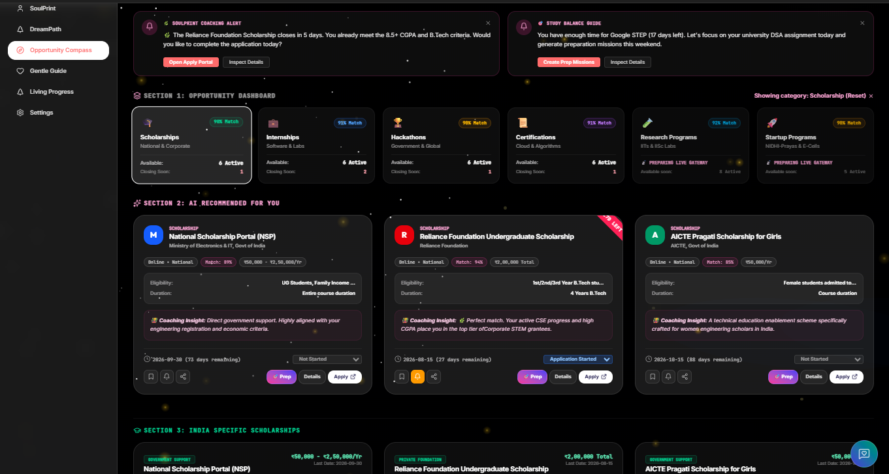
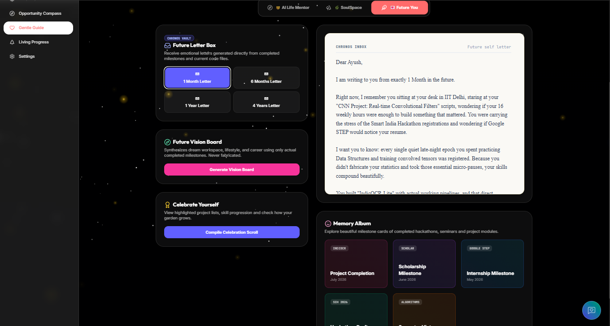
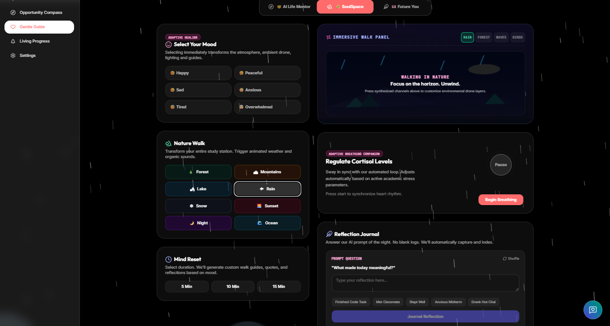
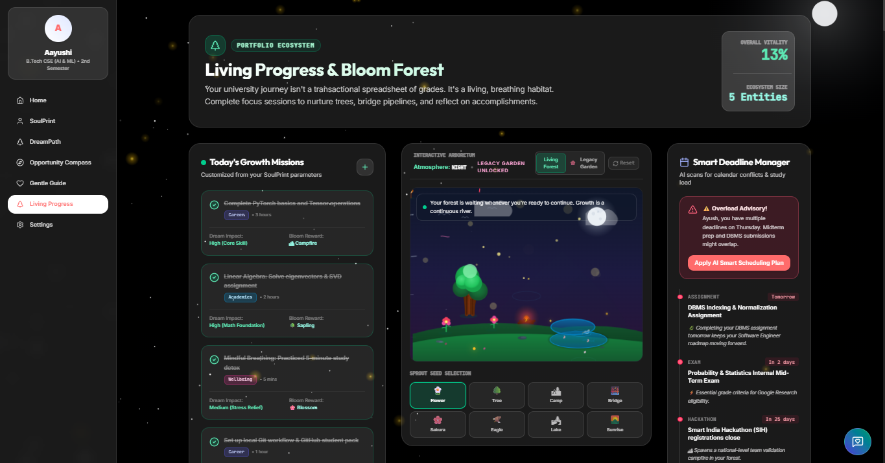
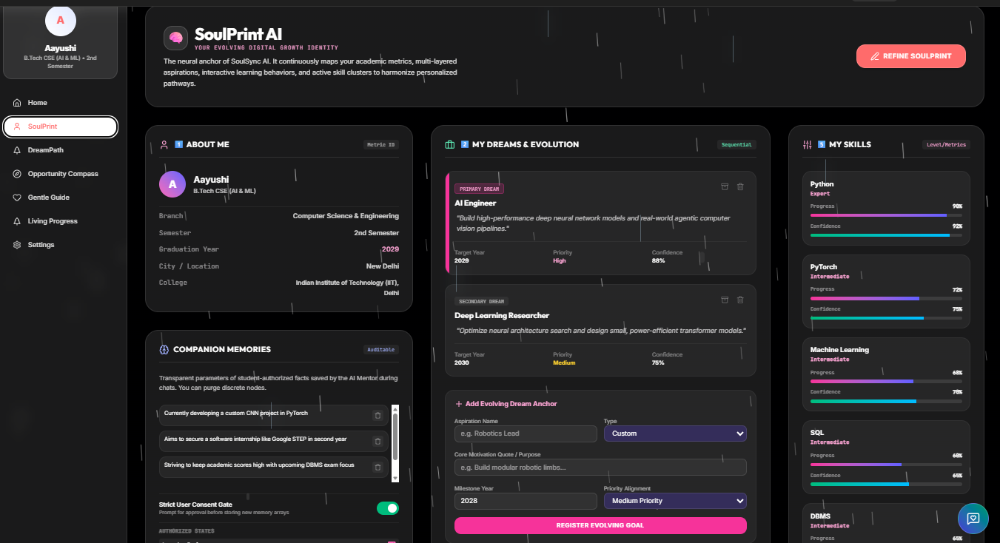

<div align="center">



# SoulSync AI

### *Understanding You Beyond Your Goals.*

<p align="center">


</p>

### 🏆 AI Impact Festival 2026 | AI Impact Creators

**SoulSync AI is an emotionally intelligent AI-powered Personal Growth Operating System that understands students beyond academics—helping them discover opportunities, build meaningful careers, navigate setbacks with compassion, and grow into the best version of themselves.**

</div>

---

# 🏗️ System Architecture

<p align="center">



</p>

---

# 📚 Table of Contents

- 🌟 Vision
- ✨ Core Features
- 📱 Application Preview
- 🚀 Technology Stack
- 🔒 Responsible AI
- 🌍 Social Impact
- 🛣️ Future Roadmap
- 💻 Local Setup
- 📄 License

---

# 🌟 Vision

Students today rely on dozens of disconnected platforms for learning, scholarships, internships, career guidance, mentorship, productivity, and personal development.

**SoulSync AI brings everything together into one compassionate AI companion.**

Instead of simply answering questions, SoulSync AI understands each student's aspirations, remembers what matters (with consent), recommends meaningful opportunities, adapts to setbacks with empathy, and supports lifelong growth.

---

# ✨ Core Features

## 🧠 SoulPrint
### *The Heart That Remembers.*

A privacy-first AI memory engine that understands the learner through explicit consent.

- Dreams & Aspirations
- Skills & Interests
- Learning Style
- Projects & Achievements
- Career Goals
- Personalized AI Memory
- Explainable Recommendations

---

## 🌱 DreamPath
### *Dreams Become Journeys.*

Transforms aspirations into personalized growth roadmaps.

- Learning Paths
- Skills Roadmap
- AI-generated Milestones
- Courses & Certifications
- Projects
- Life Trajectory Simulation
- Progress Tracking

---

## 🧭 Opportunity Compass

Finds the most relevant opportunities at the right time.

- Scholarships
- Hackathons
- Internships
- Competitions
- Research Programs
- Government Schemes
- Mentorship

Every recommendation includes:

- ✅ Why it matches
- ✅ Eligibility
- ✅ Deadline
- ✅ Confidence Score
- ✅ Source

---

## 💙 Gentle Guide
### *Growing With Kindness.*

An emotionally intelligent AI companion that adapts to real life.

- Adaptive Daily Planning
- Reflection Journal
- Quiet Moments
- Emotion-aware Guidance
- Burnout-aware Scheduling
- Monthly Letters Beyond

No streaks.

No guilt.

No punishment.

Just sustainable growth.

---

## 🤝 SoulConnect

Meaningful networking powered by AI.

Connects students based on:

- Dreams
- Skills
- Learning Style
- Goals
- Projects
- Research Interests
- Mentorship Needs

No likes.

No followers.

Only genuine collaboration.

---

## 🌳 Bloom Forest

Every meaningful achievement grows a beautiful digital forest.

Unlike conventional productivity apps:

🌱 No streak pressure

🌸 No punishment

🌿 Growth continues at your own pace

---

# 📱 Application Preview

## 🏠 Home

<p align="center">

</p>

---

## 🧠 SoulPrint

<p align="center">

</p>

---

## 🌱 DreamPath

<p align="center">

</p>

---

## 🧭 Opportunity Compass

<p align="center">

</p>

---

## 💙 Gentle Guide

<p align="center">

</p>

---

## 🤝 SoulConnect

<p align="center">

</p>

---

## 🌳 Bloom Forest

<p align="center">

</p>

---

## 👤 Personalized Profile

<p align="center">

</p>

---

## 📈 Student Transformation Journey

<p align="center">

</p>

---

# 🚀 Technology Stack

| Category | Technology |
|-----------|------------|
| AI | Google Gemini |
| Frontend | React |
| Backend | Firebase |
| Database | Cloud Firestore |
| Authentication | Firebase Authentication |
| Hosting | Vercel |
| AI Development | Google AI Studio |
| Version Control | GitHub |

---

# 🔒 Responsible AI

SoulSync AI is built around responsible and human-centered AI principles.

- 🔐 Privacy-first architecture
- 🧠 Consent-based AI memory
- 📖 Explainable recommendations
- 👤 User-owned data
- 🗑️ Delete or export data anytime
- ⚖️ Transparent AI reasoning
- 💙 Human-centered adaptive planning

---

# 🌍 Social Impact

SoulSync AI contributes towards:

- 🎓 Quality Education
- 💼 Career Readiness
- 💙 Student Wellbeing
- 🌱 Lifelong Learning
- 🤝 Equal Access to Opportunities
- 🌍 Inclusive & Personalized Education

---

# 🛣️ Future Roadmap

- Google Workspace Integration
- Google Calendar Synchronization
- AI Mentor Marketplace
- Voice Conversations
- Mobile Application
- Smart Opportunity Alerts
- Community Challenges
- Multi-language Support

---

# 💻 Local Setup

```bash
git clone https://github.com/<your-username>/<repository-name>.git

cd <repository-name>

npm install

npm run dev
```

---

# 📄 License

This project is developed for the **India AI Impact Festival 2026** under the **AI Impact Creators** category.

---

<div align="center">

## 💙 SoulSync AI

### *Understanding You Beyond Your Goals.*

**Built with ❤️ using Google AI Studio, Gemini, Firebase, React & Vercel**

**🇮🇳 India AI Impact Festival 2026**

</div>
